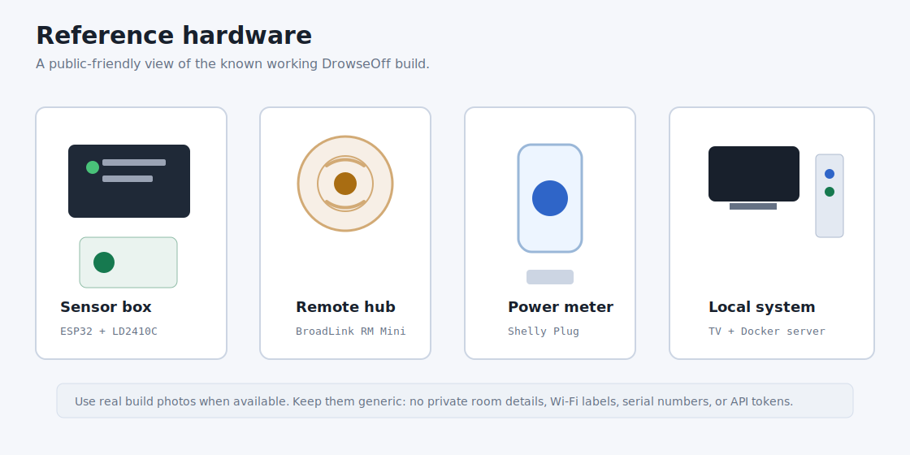
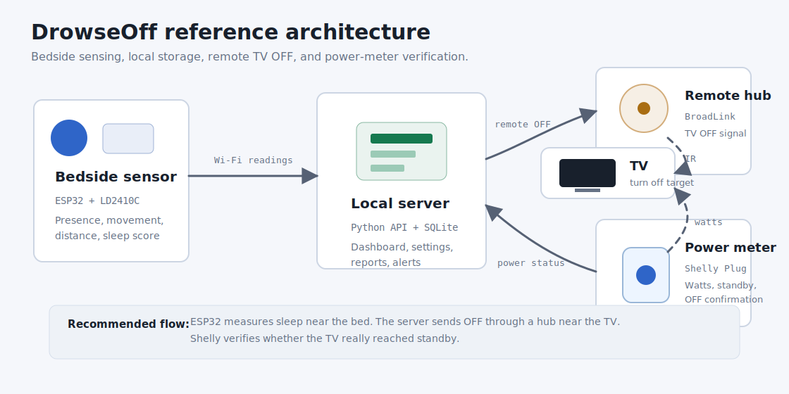
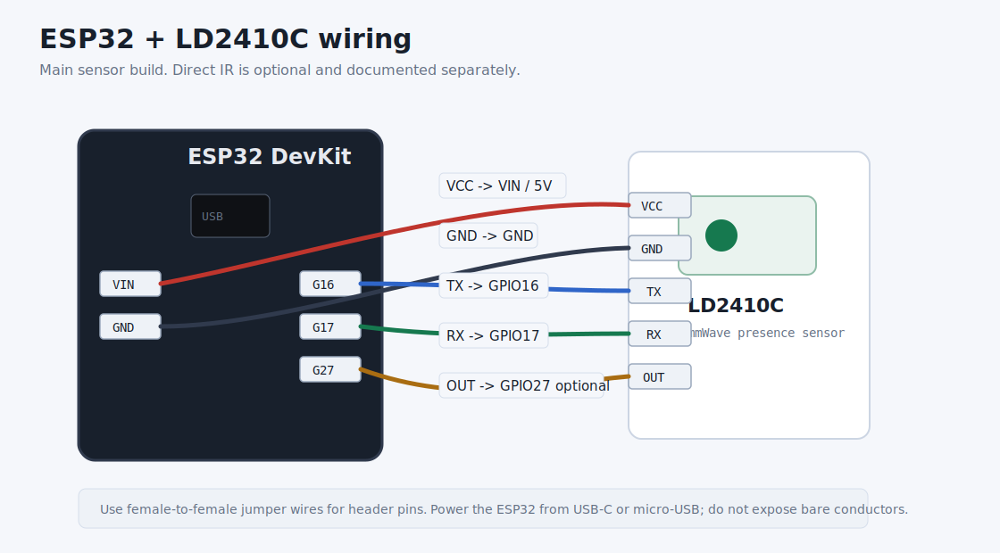
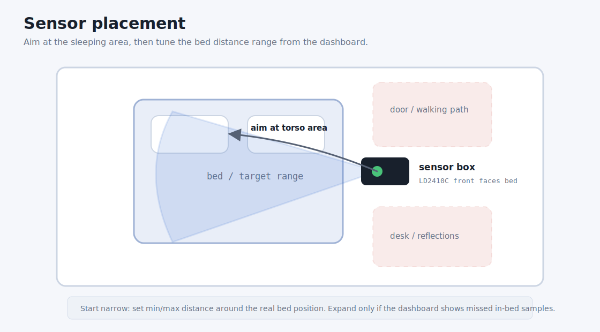

# DrowseOff Hardware Guide

This guide documents the reference hardware build for DrowseOff and the most
common alternatives. It is written for beginners and for contributors who want
to adapt the project to different rooms or remote-control hardware.

## Recommended Build

The reference build separates sensing from TV control:

- the ESP32 and LD2410C sit near the bed;
- the DrowseOff API runs on an always-on local server;
- a BroadLink-compatible IR hub sits near the TV;
- an optional Shelly Plug measures whether the TV is really on or in standby.

This layout is more reliable than trying to point a small IR LED from the bed
to the TV. The sensor can stay where sleep detection works best, while the
remote hub can stay where IR works best.

## Build Profiles

| Profile | Hardware | Best for | Tradeoffs |
| --- | --- | --- | --- |
| Recommended | ESP32 + LD2410C + local server + BroadLink + Shelly | Reliable TV OFF plus verification | More devices to configure |
| Minimal remote | ESP32 + LD2410C + local server + BroadLink | Most users who only need TV OFF | Cannot verify power state without Shelly |
| Sensor-only | ESP32 + LD2410C + local server | Monitoring and calibration | No automatic TV OFF |
| Direct IR fallback | ESP32 + LD2410C + IR transmitter | Fully DIY builds near the TV | Weak modules may need careful aiming or stronger IR hardware |

## Bill of Materials

| Component | Required | Purpose | Known working type | Alternatives |
| --- | --- | --- | --- | --- |
| ESP32 development board | Yes | Reads the radar sensor and posts readings to the API | ESP32 DevKit / ESP32-WROOM board | ESP32-S3/C3 boards with firmware pin adjustments |
| LD2410C mmWave sensor | Yes | Detects presence, movement, stillness, and target distance | Hi-Link HLK-LD2410C | Other LD2410 variants, with firmware/library checks |
| Jumper wires | Yes | Connect ESP32 to LD2410C | Female-to-female Dupont wires | Breadboard wires, soldered harness |
| Small plastic enclosure | Recommended | Protects the ESP32 and sensor | ABS electronics box | 3D printed case, project box |
| Local server | Yes | Runs API, dashboard, SQLite, remote backend | Mini PC, NAS, Raspberry Pi, always-on desktop | Any Docker-capable machine |
| BroadLink IR hub | Recommended | Sends TV OFF near the TV | RM Mini 3 / RM4 Mini class device | SwitchBot Hub, Home Assistant remote entity, future providers |
| Shelly Plug power meter | Optional | Confirms whether TV is on or standby | Shelly Plug S Gen3/MTR Gen3 | Other local HTTP/MQTT power meters, future providers |
| Direct IR transmitter | Optional | ESP32 hardware fallback | 38 kHz IR transmitter module | Stronger transistor-driven IR LED circuit |

Official/reference pages:

- ESP32 DevKitC overview: <https://www.espressif.com/en/products/devkits/esp32-devkitc/overview>
- LD2410C product page: <https://www.hlktech.net/index.php?id=1095>
- BroadLink downloads/manuals: <https://www.ibroadlink.com/downloads>
- Shelly Plug S MTR Gen3 knowledge base: <https://kb.shelly.cloud/knowledge-base/shelly-plug-s-mtr-gen3>

## Main Sensor Wiring

| LD2410C pin | ESP32 pin | Notes |
| --- | --- | --- |
| `VCC` | `VIN` / `5V` | Power from the ESP32 USB supply |
| `GND` | `GND` | Common ground |
| `TX` | `GPIO16` | Sensor transmit to ESP32 receive |
| `RX` | `GPIO17` | Sensor receive from ESP32 transmit |
| `OUT` | `GPIO27` | Optional digital presence output |

The firmware currently uses UART data from `TX`/`RX` for distance, movement,
stillness, and energy values. The `OUT` pin is useful for simple hardware tests
but is not enough for the full DrowseOff scoring logic.

## Optional Direct IR Wiring

Direct IR is no longer the recommended default, but the firmware still supports
it as a fallback.

| IR module pin | ESP32 pin | Notes |
| --- | --- | --- |
| `VCC` | `3V3` | Some modules also accept 5V; check yours |
| `GND` | `GND` | Common ground |
| `DAT` / `SIG` | `GPIO23` | IR send pin used by the firmware |

Small ready-made IR transmitter modules often work only at short range. If the
TV is far from the bed, use a remote hub near the TV or a stronger transistor
driver circuit.

## Placement

Start with the sensor near the bed, aimed at the torso area rather than at the
whole room. Use the dashboard calibration tools to narrow the valid distance
range. A narrower range usually reduces false positives from doors, desks,
walking paths, and reflected movement.

Good placement habits:

- keep the sensor stable and fixed in one position;
- point the LD2410C front face toward the bed;
- avoid aiming directly at doors, fans, curtains, or busy walking paths;
- start with a narrow bed range and expand only if in-bed readings are missed;
- restart the ESP32 after large `distance_max_cm` changes when radar boot
  configuration is enabled.

## Assembly Checklist

1. Connect the ESP32 and LD2410C on the bench.
2. Upload the firmware from Arduino IDE.
3. Open Serial Monitor and verify `Radar: OK`.
4. Start the local API and dashboard.
5. Confirm the dashboard receives live readings.
6. Place the sensor near the bed and run calibration.
7. Configure the remote hub and learn the TV OFF command.
8. If using Shelly, verify `TV power` changes between TV on and standby.
9. Run a manual `Send TV OFF` test and confirm the dashboard records the result.

## Public Photo Policy

Real photos are welcome, but only when they are safe to publish:

- use your own photos, or images with a clear license that allows reuse;
- do not copy marketplace images unless their license explicitly allows it;
- avoid visible Wi-Fi names, serial numbers, QR codes, room details, or account
  information;
- prefer clean bench photos over private bedroom photos;
- keep product/vendor photos as links when licensing is unclear.

Suggested future photo slots:

- `docs/assets/photos/sensor-box.jpg` - finished ESP32/LD2410C enclosure;
- `docs/assets/photos/bench-wiring.jpg` - wiring before closing the box;
- `docs/assets/photos/remote-hub-placement.jpg` - generic BroadLink placement;
- `docs/assets/photos/shelly-meter.jpg` - Shelly plug installed without private
  labels visible.

## Troubleshooting

| Symptom | Likely cause | What to check |
| --- | --- | --- |
| Always detects presence | Range too wide, reflections, sensor aimed at room traffic | Narrow distance range, rotate sensor, test away from doors |
| Sleep score never rises | Person not inside configured bed range | Use calibration and check filtered distance |
| TV OFF command sent but TV remains on | Remote hub position or learned code issue | Move hub closer, relearn OFF, check power alert |
| Power meter says TV is always on | Threshold too low or TV standby is high | Compare on/standby wattage and adjust `SHELLY_ON_THRESHOLD_W` |
| ESP32 offline | Wi-Fi, API token, server URL, or power issue | Serial Monitor, dashboard component status, `/api/health` |
