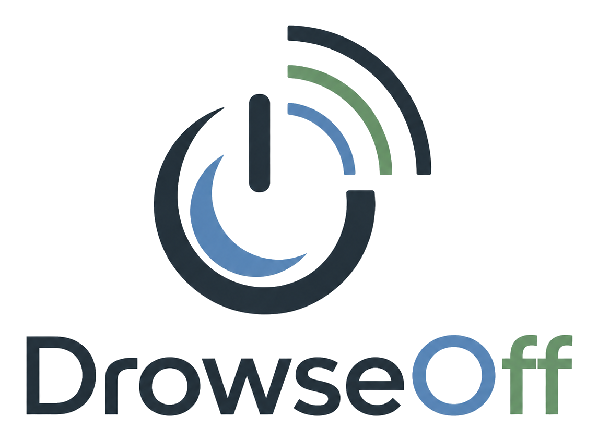

# DrowseOff API



Local API and dashboard for DrowseOff. It receives ESP32 sensor readings,
stores them in SQLite, renders the web dashboard, and can send a TV OFF command
through a configurable remote backend.

## Structure

```text
app.py                         # minimal entrypoint
tv_sleep/config.py             # paths and environment variables
tv_sleep/db.py                 # SQLite schema and queries
tv_sleep/reports.py            # session summaries and chart series
tv_sleep/remote_control.py     # provider-neutral remote control facade
tv_sleep/power_meter.py        # optional TV wattage provider facade
tv_sleep/broadlink_remote.py   # BroadLink implementation
tv_sleep/server.py             # HTTP server, API routing, static files
templates/dashboard.html
static/brand/                  # logo and app icons
static/app.css
static/app.js
```

## Configuration

Create a local `.env` file from the example:

```bash
cp .env.example .env
```

Then adjust the values for your home network:

```env
TZ=UTC
DROWSEOFF_HOST_PORT=8010
DROWSEOFF_DB=/data/drowseoff.db
DROWSEOFF_API_TOKEN=replace-with-a-long-random-token
DROWSEOFF_ALLOW_UNAUTHENTICATED_API=0
DROWSEOFF_CORS_ORIGIN=
DROWSEOFF_DEFAULT_SENSOR_DEVICE_ID=drowseoff-sensor

DROWSEOFF_REMOTE_PROVIDER=broadlink
DROWSEOFF_REMOTE_AUTO_ENABLED=1
BROADLINK_HOST=192.168.1.100
BROADLINK_PACKET_PATH=/data/broadlink_tv_off.b64
BROADLINK_STATUS_PROBE_INTERVAL=60

DROWSEOFF_POWER_METER_PROVIDER=shelly
SHELLY_HOST=192.168.1.120
SHELLY_SWITCH_ID=0
SHELLY_ON_THRESHOLD_W=30
SHELLY_STATUS_CACHE_SECONDS=5
```

Do not commit `.env`, database files, or learned IR packet files.

Generate a long local token with a password manager or a command such as:

```bash
openssl rand -hex 32
```

`DROWSEOFF_API_TOKEN` is required for normal use. Every API endpoint except
`/api/health` requires the token through either:

```text
X-DrowseOff-Token: YOUR_TOKEN
Authorization: Bearer YOUR_TOKEN
```

Set the same value in the firmware `API_TOKEN_VALUE`. In the dashboard, use the
API Token button to save it in that browser. For quick trusted-LAN experiments,
you can set `DROWSEOFF_ALLOW_UNAUTHENTICATED_API=1`, but that allows anyone who
can reach the server to read data and trigger commands. `DROWSEOFF_CORS_ORIGIN`
is blank by default; set it only when a separate web origin must call the API.
Do not expose this service directly to the public internet without a reverse
proxy, TLS, and an access policy you trust.

When upgrading an older local install that had no token, either set
`DROWSEOFF_API_TOKEN` and copy the same value into firmware `API_TOKEN_VALUE`, or
temporarily set `DROWSEOFF_ALLOW_UNAUTHENTICATED_API=1` for a trusted LAN-only
setup.

DrowseOff uses `DROWSEOFF_*` environment variables for server configuration.

## Docker Startup

From this directory:

```bash
docker compose up -d --build
```

If your server firewall blocks the dashboard port, allow access from your local
network. Example for UFW:

```bash
sudo ufw allow from 192.168.1.0/24 to any port 8010 proto tcp
```

Open the dashboard at:

```text
http://YOUR_SERVER_IP:8010/
```

The Docker image includes a healthcheck against `/api/health`.

## Main API Endpoints

```text
GET  /api/health
GET  /api/devices
GET  /api/latest
GET  /api/summary
GET  /api/session
GET  /api/session-summary
GET  /api/sleep-series
GET  /api/calibration
GET  /api/settings
POST /api/settings
GET  /api/readings
POST /api/readings
GET  /api/events
POST /api/events
GET  /api/commands
POST /api/commands
POST /api/commands/cancel
GET  /api/power/status
GET  /api/power/readings
GET  /api/export/readings.csv
GET  /api/export/events.csv
GET  /api/export/commands.csv
GET  /api/export/power-readings.csv
```

Most read endpoints accept an optional `device_id` query parameter, for example
`/api/session?device_id=drowseoff-sensor`. Without `device_id`, the dashboard
and API return the combined view across all stored devices.

## Remote Control API

Provider-neutral endpoints:

```text
GET  /api/remote/status
GET  /api/remote/probe
POST /api/remote/send-off
POST /api/remote/learn/start
POST /api/remote/learn/check
GET  /api/power/status
GET  /api/power/readings
```

Send TV OFF through the configured remote provider:

```bash
curl -X POST http://localhost:8010/api/remote/send-off \
  -H "Content-Type: application/json" \
  -H "X-DrowseOff-Token: YOUR_TOKEN" \
  -d '{"repeat_count":1,"source":"manual"}'
```

Queue a TV OFF command for the ESP32 IR fallback:

```bash
curl -X POST http://localhost:8010/api/commands \
  -H "Content-Type: application/json" \
  -H "X-DrowseOff-Token: YOUR_TOKEN" \
  -d '{"command_type":"tv_off","repeat_count":1,"source":"dashboard"}'
```

## ESP32 Firmware

The firmware periodically reads device settings from:

```text
http://YOUR_SERVER_IP:8010/api/settings/device
```

Important settings:

```text
auto_power_enabled=1   # automatic TV OFF enabled
auto_power_enabled=0   # monitoring only
sleep_threshold=600    # roughly 10 calm minutes with the default scoring
esp32_ir_auto_enabled=0 # ESP32 does not auto-send direct IR
esp32_ir_auto_enabled=1 # ESP32 auto-sends direct IR on threshold
```

The dashboard exposes these settings in the Settings tab. Manual TV OFF commands
remain available even when automatic TV OFF is disabled.

Keep `esp32_ir_auto_enabled=0` when using a remote hub such as BroadLink. Enable
it only if the ESP32 has a working IR transmitter that should act as the
automatic TV OFF device.

Arduino OTA is disabled unless the firmware `secrets.h` explicitly sets
`OTA_ENABLED_VALUE true` and a non-empty `OTA_PASSWORD_VALUE`. Do not enable OTA
without a local password.

When firmware `CONFIGURE_RADAR_ON_BOOT_VALUE` is enabled, the LD2410C hardware
range is recalculated at boot from `distance_max_cm`. If you materially change
the bed range in the dashboard, restart the ESP32 so the radar gate
configuration matches the new placement.

The firmware also sends `score_reason`, a human-readable reason for score
changes, such as `+1 stable and still` or `-8 strong movement`.

The dashboard Device filter, report endpoints, CSV exports, and calibration
view can be scoped to one `device_id`.

## BroadLink Workflow

Set these values in `.env`:

```env
DROWSEOFF_REMOTE_PROVIDER=broadlink
DROWSEOFF_REMOTE_AUTO_ENABLED=1
BROADLINK_HOST=192.168.1.100
BROADLINK_PACKET_PATH=/data/broadlink_tv_off.b64
BROADLINK_STATUS_PROBE_INTERVAL=60
```

Learning flow from the dashboard:

1. Open the TV Commands tab.
2. Press Start Learning.
3. Send the TV OFF command toward the BroadLink device.
4. Press Save OFF Code.

The dashboard treats a remote as ready only when it is configured with a host,
has a saved OFF packet, and the latest connectivity probe succeeded.
`BROADLINK_STATUS_PROBE_INTERVAL` controls how often `/api/remote/status`
refreshes that probe cache. A real send remains the strongest end-to-end test.

The threshold event itself is stored as `tv_off_threshold_reached`. A successful
remote provider send is stored separately as `tv_off_remote_auto` or
`tv_off_remote_manual`. A successful direct ESP32 automatic IR send is stored as
`tv_off_esp32_auto`; a manual dashboard command completed by the ESP32 is stored
as `tv_off_esp32_manual`. Remote failures are stored as `tv_off_remote_failed`.

When a power meter is configured, DrowseOff also verifies remote OFF commands
after a short delay. A confirmed drop below the wattage threshold is stored as
`tv_off_power_confirmed`; a still-on reading is stored as
`tv_off_power_still_on`; an unreachable meter during confirmation is stored as
`tv_off_power_unknown`.

## Shelly Power Meter

Set these values in `.env` to read TV wattage from a Shelly Plug S Gen3/MTR Gen3:

```env
DROWSEOFF_POWER_METER_PROVIDER=shelly
SHELLY_HOST=192.168.1.120
SHELLY_SWITCH_ID=0
SHELLY_ON_THRESHOLD_W=30
SHELLY_STATUS_CACHE_SECONDS=5
DROWSEOFF_POWER_SAMPLE_SECONDS=60
DROWSEOFF_POWER_CONFIRM_DELAY_SECONDS=20
```

The Shelly output must stay on. DrowseOff uses the plug only as a meter, not as
a hard power cut. `/api/power/status` returns the current watts and whether the
TV is considered on. Automatic TV OFF is skipped when the meter is ready and the
TV is already below `SHELLY_ON_THRESHOLD_W`; that event is stored as
`tv_off_skipped_tv_already_off`.

The server stores power samples in `power_readings` every
`DROWSEOFF_POWER_SAMPLE_SECONDS`. These rows drive session estimates such as TV
on time, standby wattage, energy used, and how long the TV stayed on after the
sleep threshold was reached. Export them with:

```text
GET /api/export/power-readings.csv
```

## Home Assistant

The simplest Home Assistant integration is a REST command:

```text
POST http://YOUR_SERVER_IP:8010/api/remote/send-off
Header: X-DrowseOff-Token: YOUR_TOKEN
```

Payload:

```json
{"repeat_count":1,"source":"home-assistant"}
```

MQTT is a useful future option for larger IoT setups, but the current HTTP flow
is intentionally simple to debug.

## Manual Test

```bash
curl -X POST http://localhost:8010/api/readings \
  -H "Content-Type: application/json" \
  -H "X-DrowseOff-Token: YOUR_TOKEN" \
  -d '{"device_id":"test","radar_ok":true,"presence":true,"in_bed":true,"dist_raw":70,"dist_filtered":72,"sleep_score":10}'
```

## Database

The default Docker database path is:

```text
./data/drowseoff.db
```
